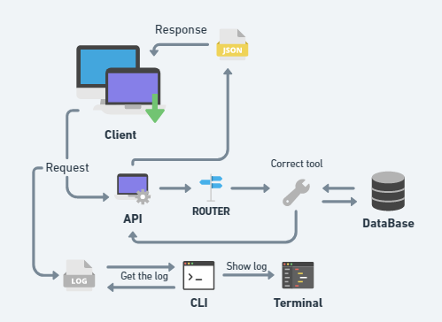

# 42Labs 

This challenge is to build an api and a cli that accepts requests from clients.
The intention of this is to take the first step towards the job market with 42.

## Tools
I usaged whimsical to make the fluxogram: (https://whimsical.com/api-WLFKf9pTWGEZLiC4wSSpJQ)

Usaged mongoose lib: (https://github.com/cesanta/mongoose)
- These help me for connect devices and bringing them online.

Usaged MySql Api with DataBase:
- Searching the way to my database, this was the one that had more useful information on the internet and in the community.
- Allows me to save the data that the API will return to the client.
# API
## How to install
- Clone this repository ( make sure you have mysql api installed in your environment).
- Inside the cloned folder, change to Api folder and execute 'make'.
- After execute './server' and API is ready.
### Executions
- You can use any request tool like [PostMan](https://www.postman.com), [Insomnia](https://insomnia.rest), [Thunder Client](https://www.thunderclient.com).
- GET in /cars will show all cars in database.
- GET in /cars/{Id} will show car in database with that id.
- POST in /cars will place a car in database. The parameters must be passed in the body in JSON format.
- PUT in /cars/{Id} will update a car in database. The parameters must be passed in the body in JSON format.
- DELETE in /cars/{Id} will delete car in database with that id.

## Where would this API be useful?
- In case of database expansion, this API would be useful for any dealership to request the price of a car in stock, using the database as stock control.

# CLI
## How to install

### Executions

## Collaborators
- Flavio (flda-sil).
- Maycon (mjose-ye).
- Juliana (jmilson-).

## Bibliography
- https://www.smashingmagazine.com/2018/01/understanding-using-rest-api/
- https://mongoose.ws/documentation/#user-guide
- https://zetcode.com/db/mysqlc/