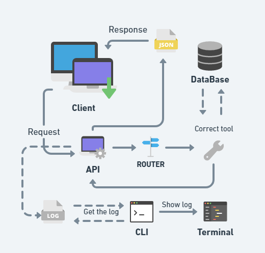

# 42Labs 

This challenge is to build an API and a CLI that accepts requests from clients.
The intention of this is to take the first step towards the job market with 42.

## Tools
I used whimsical to make the fluxogram:



Used mongoose lib: (https://github.com/cesanta/mongoose)
- This help me for connect devices and bringing them online.

Used MySQL API with DataBase:
- Searching the way to my database, this was the one that had more useful information on the internet and in the community.
- Allows me to save the data that the API will return to the client.

Used Thunder Client extension:
- This made it possible to make requests in addition to GET.
#
# API
## How to install
- Clone this repository ( make sure you have MySQL API installed in your environment).
- Inside the cloned folder, change to API folder and execute `make`.
- After execute `./server` and API is ready.
### Executions
- You can use any request tool like [PostMan](https://www.postman.com), [Insomnia](https://insomnia.rest), [Thunder Client](https://www.thunderclient.com).
- `GET /cars` will show all cars in database.
- `GET /cars/{Id}` will show a car in the database with that id.
- `POST /cars` will place a car in database. The parameters must be passed in the body in JSON format :
``` json
{ "name":"name of car", "price": value }
```
- `PUT /cars/{Id}` will update a car in database. The parameters must be passed in the body in JSON format.
- `DELETE /cars/{Id}` will delete car in database with that id.

## Where would this API be useful?
- In case of database expansion, this API would be useful for any dealership to request the price of a car in stock, using the database as stock control.
#
# CLI
## How to install
- Clone this repository.
- Inside the cloned folder, change to folder CLI and execute `make`.
- After, execute `./cli` and CLI is ready.

### Executions
- To see the logs, run command `show`, this will show all logs currently present in start of CLI.
- To refresh logs, run command `att`, this will show the new logs only.
- To clear terminal, run command `clean`.
- To stop the CLI process, run command `exit`. 
#
# Docker
## How to install
- The image is private, while the 42Labs proccess is not finished. In future I wish launch this.
- Make sure you have docker installed in your environment. See how in [HOW INSTALL DOCKER](https://docs.docker.com/engine/).
- With dockerfile in root of project, run command `sudo docker build -t gsilvav/container_api:0.3 .`
- After download, run `sudo docker run -d -t -p 8000:8000 --name api gsilvav/container_api:0.3`, this will initialize the container.
- When initialize container, enter in image to start DataBase:
  - To enter, run `sudo docker exec -it api bash`.
  - After, start MySQL with `/etc/init.d/mysql start`.
  - When complete all steps, the container is done.

### Executions
- To start server externally, run `sudo docker exec -ti -d teste ./Api/server`.
- The CLI still cannot be accessed externally, so re-enter the container and run `./CLI/cli`.

#
## Collaborators
- Flavio (flda-sil).
- Maycon (mjose-ye).
- Hugo (hmiguel-).
- Juliana (jmilson-).

## Bibliography
- [API REST](https://www.smashingmagazine.com/2018/01/understanding-using-rest-api/)
- [Mongoose Docs](https://mongoose.ws/documentation/#user-guide)
- [MySQL Tutorial](https://zetcode.com/db/mysqlc/)
- [Docker](https://docs.docker.com/engine/)